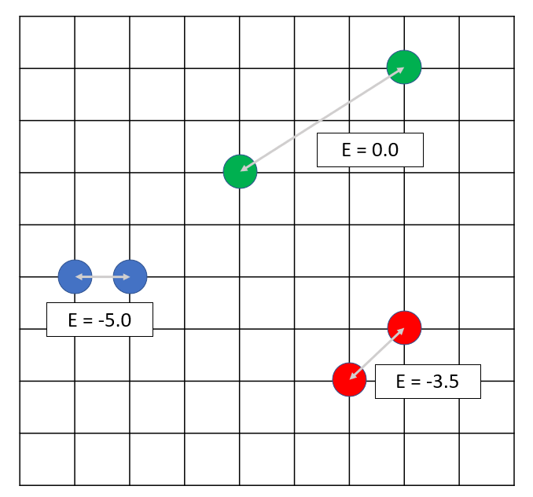
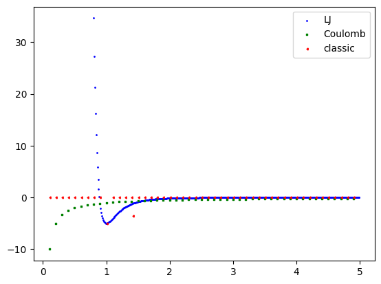

layout: page
title: "Particle tango"
permalink: particle_tango
## The task at hands
Suppose you have the following task: there are two particles on a L by L, square lattice, they can interact in three ways (particles are located in the vertices of the lattice):
- if the distance is 1 (particles on the edge of the square), the energy of interaction is -5 (in arbitrary energy units)
- if the distance is $$\sqrt(2)$$ the energy of interaction is -3.5
- otherwise, the interaction energy is zero

What are the properties of such system? How would you evaluate the average energy of the system, average the distance between particles? And how would all this stuff be affected by changes in temperature?
## Solutions
Physical chemistry and statistical thermodynamics offer some solutions for problems involving particles and their interaction (in non-quantum way). But first, let's talk thermodynamics. 
### Ergodic hypothesis
We have to sort out some technical stuff before we can go straight to calculations. Let's ask ourselves a question: how can we describe the system and it's evolution in time? 
#### Statistical ensemble
The most obvious way - save all of the coordinates of all of the N particles in the system and then look at the evolution of these coordinates. Taking $x,y,z$ for every one of the N particles gives us 3N coordinates. It corresponds with the vector in 3N-dimensional space. Kinda hard to imagine, but if you try to wrap your mind around it, it's just a fancy way to store your coordinates. This space is called **configurational space**.

> - How can one imagine 3-dimensional sphere?
> - Oh, it's vey simple. Just imagine the N-dimensional sphere and then set $N = 3$

You can now do the same thing to the momenta of N particles. Since we have three components to it, $p_x, p_y, p_z$ , this also gets us a 3N-dimensional space.

You can also combine these spaces and get a 6N-dimensional **phase** space (3N coordinates $x_i, y_i,z_i$, and 3N momenta $p_x, p_y, p_z$). But what's for us in it? Every point in this space represents coordinates and momenta (velocity) of all of the particles at some point in time. We can now apply Newtonian mechanics to it and "let it go" - it will evolve in time according to any logic for velocity and coordinate change we put into it.

Okay, now we have a point in this phase space. Let's call it a *micro*state - after all, it's an arrangement of particles that happens on a molecular level. How can we get to the *macro*state - something we can see and measure? We could average over tons of microstates. This set of states is called a **statistical ensemble**.
#### Calculation of properties
Now, when we average properties over the ensemble, we are faced with the nature's heartless bitchiness. Only the simplest systems are averaged over easily. For others you often get some integrals over the functions which exact form is unknown...

Luckily, there is a solution! We can now invoke the **ergodic hypothesis**. In my chopped-up explanation it sounds like this: if you let some system evolve long enough and then average the properties over it's trajectory in the phase space, you get the same result as if you averaged over the ensemble of countless different "frozen" states. Pretty cool, huh?

Two main options to go from here: molecular dynamics and Monte-Carlo simulation. The former is a "simulation" of the system with the approximated potentials. The latter is the sort-of-simulation that does not require evolution in time, but rather is a random walk between the states of the system.
## Monte-Carlo simulation
Finally, we have arrived to the point where we start doing something.

> **DISCLAIMER**
> I am not a coder and never has been one. I am sure there are better and more efficient ways to write this code. But for me it does it's job just right to be happy about it. 

We will use the Metropolis-Hastings algorithm to generate and sample new states. You can read about it on [Wikipedia](https://en.wikipedia.org/wiki/Metropolis%E2%80%93Hastings_algorithm).
1. Generate a starting position: randomly place your particles on the lattice (check for interference: two particles cannot occupy the same space). Set the temperature **T** in abstract units and compute it's energy
2. Let my particles go! Randomly pick one of the two particles, then change it's coordinates (again, randomly and mind the interference). Assign this as a **new state**.
3. Calculate the energy of the new state.
4. Compute the **decision factor** $k = \exp((E_{old}-E_{new})/T))$ 
5. Generate a random number $u\in [0,1]$ 
6. Compare the two numbers:
	- if $u \leq k$ - accept the new state as old state (make a step)
	- otherwise, stay in the old state
7. Repeat stuff.
This awesome algorithm works because we stay in the lower-energy states more than in higher-energy states, which should represent our ensemble nicely after averaging along the "trajectory".
## Results
I won't bother you with the code here, just a couple of things that I thought looked nicely.
### Energy-distance relation
First, let's look at the distances and how it relates to the energy of the system. Here we have a two-particle system on a 10x10 lattice with 10000 steps of MC algorithm.

On the energy graph, there are three distinct cases: energy is either zero, -3.5 or -5. If we now look at the distance we will see our formulation of the task - each minimum in energy corresponds to the distance = 1, each -3.5 peak corresponds to the diagonal position. All zero-energy states correspond to every other distance.

### It's getting hot in here!

Let's heat the system up! We will now increase the temperature and look at the distance graph (yeah it's a bit funky).

When the temperature of the system is very low, particles get "stuck" in the lowest-energy position - so to say, they don't have enough energy to jump from place to place. Should we start increasing the temperature, we change the exponent in the decision coefficient and make transitions from lower-energy states to higher-energy states more probable and favorable. As a result, the average distance increases. Particles "go crazy" and start running around. 

It's interesting to think about the energy of the heat motion of molecules. The kinetic energy of a molecule is:
$$E_k = \frac{3}{2} k_BT =\frac{3}{2}T$$ 
In our scenario we have $k_B=1$ as it is way easier to work in dimensionless units. 
It just so happens that the temperature is the measure of the energy. (It should be noted that the expression above is valid when energy is averaged over the huge number of particles, but we are going to ignore that). We increase the temperature and so increase the energy of the system. Particles start moving. 

The interesting thing can happen at the low-temperature states such as $T=0.7$ . Kinetic energy is less than potential, however one particle can "roll out" of the potential well. This is the consequence of our simulation method, since the position is picked randomly. So it is not a true "let go of the system and watch it move"

## Other potentials

From here we can go anywhere we want. We can add other potentials: Lennard-Jones, Coulomb, Morse and so on. (I have currently implemented only LJ and C potentials)
### Lennard-Jones

This is the most famous potential to simulate the behavoiur of the molecules.
$$E(r) = 4\varepsilon \left((\frac{\sigma}{r})^{12}-(\frac{\sigma}{r})^{6} \right)$$
Here $\sigma$ is the distance where the potential is equal to zero (set so that $r_{min}=2^{1/6}\sigma=1$) and $\varepsilon$ is the depth of the potenial well ($\varepsilon=5$, same as our "classic" potential at $r=1$).

The general picture is pretty much the same, however we no longer see a lot of "stubs" from diagonal configuration where the distance is $\sqrt(2)$. We used to have energy = -3.5 in that position, but this value is smaller for LJ potential.

### Coulomb potential

Simple attractive potential if we set the charges to be 1 and -1 for our particle (and again, the constant k is dimensionless!)
$$E(r) =k\cdot\frac{q_1q_2}{r}= -\frac{1}{r}$$
Again, let's work in dimensionless units.

Now our temperatures are "too hot" to see the different states, but what we see is that the average distance skyrockets in comparison to our original potential and LJ. I don't have any fun explanation at hand. It probably has something to do with the way the potentials behave over the distance.

Sooo, that's probably it. The Coulomb potential is very shallow, so it responds to the temperature rise very quickly. Lennard-Jones potential is way less deep than our "classic" one at $r=\sqrt(2)$. 

Now, I'm curious: what would happened if we changed the potential to be repulsive? My prediction is that the average distance will behave backwards - start from high value and then drop down as we go.

Yep. That's exactly what's happening. Heating up the system brings charges closer, but the repulsive forces are very strong.
## Conclusion

This is a fun little exercise that hides lots of interesting math, physics and coding questions. In theory, by expanding this scheme you could describe larger systems and get some insight into their behavior. If you know the potentials (and have a big enough computer), sky's the limit.

The code can be found here: https://github.com/Onelightayear/2D-lattice-MC.git

## Addendum 1 : calculation of averages

The approach I used in this article is known as averaging over the statistical ensemble. In principle, if you have a distribution density function $p(x)$, you can get an average of any parameter like this:
$$\braket{A}=\int A\cdot p(x)dx$$
where x is a general variable. This formula is a continuos definition of an average of the data. If you have some discrete points $A_i$ each weighing $p_i$, you get this:
$$\braket{A}=\frac{\sum_i A_i\cdot p_i}{\sum_i p_i}$$
And the last formula is exactly what we need in our case. If we take Boltzmann formulation of the statistical weight, we get that $$p_i = exp({-(E_i-E_{min})/k_BT})=exp({-(E_i-E_{min})/T})$$
Actually it is the formula I doubt the most, but the general results I get by using it correlate with the behavior of the system that I see and it doesn't show anything inadequate about it.

Now for any property of the system we can get it's average:
$$\braket{A}=\frac{\sum_iA_i\cdot exp({-(E_i-E_{min})/k_BT})}{\sum_i exp({-(E_i-E_{min})/k_BT})}$$
In the code I have uploaded to the GitHub (*vide supra*) I use this formula to get the average energy of the system and average distance (by saving the energy of every state). I have also used the following formula to estimate the entropy of the system:
$$S=-k_B\sum_i p_i\cdot \ln(p_i)=-\sum_i p_i\cdot \ln(p_i)$$
You can imagine some other properties if you want and get their average using the formulation above. Feel free to play with the code, write your own potentials there and test for different temperatures.

You can also check out my code for solving the 1D spin chain, which I plan on writing about in the future. I may also try to tackle 2D Ising spin model, but we'll see about that. Stay tuned!
